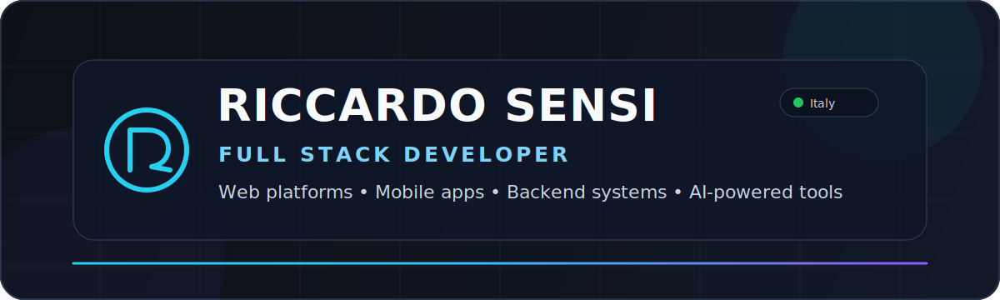
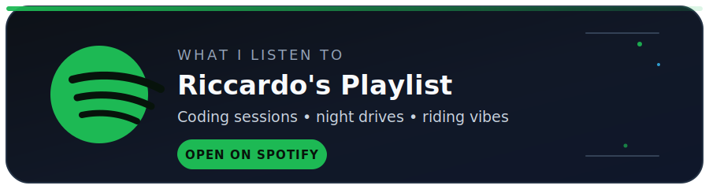

  

  

  
  
  
  

---

## 👨‍💻 About Me

I'm a **Full Stack Developer from Italy** focused on building complete, maintainable software solutions — from database design and backend APIs to responsive web interfaces and cross-platform mobile applications.

I mainly work with **TypeScript, Node.js, PostgreSQL, React, Vue and Flutter**. I also use **Docker, Linux, Nginx and GitHub Actions** to ship and manage applications across development and production environments.

I enjoy solving real-world problems, improving developer workflows and experimenting with **AI agents, automation and LLM integrations**.

---

## 🧩 Core Areas

  
  
  
  

  
  

---

## 🛠️ Tech Stack

### Frontend & Mobile

  

### Backend & Data

  

### DevOps & Tools

  

---

## 🚀 What I Build

- Full-stack web platforms and administrative dashboards
- Flutter applications for Android and iOS
- REST APIs, authentication systems and backend architectures
- PostgreSQL databases and ORM integrations
- Dockerized development and production environments
- AI-powered tools, agents and workflow automations
- Open-source libraries and reusable developer tooling

---

## 🔭 Current Focus

  
  
  
  
  

---

## 📊 GitHub Activity

  
  

  

  <picture>
    <source
      media="(prefers-color-scheme: dark)"
      srcset="https://raw.githubusercontent.com/riccardosensi99/riccardosensi99/output/github-contribution-grid-snake-dark.svg"
    />
    <source
      media="(prefers-color-scheme: light)"
      srcset="https://raw.githubusercontent.com/riccardosensi99/riccardosensi99/output/github-contribution-grid-snake.svg"
    />
    
  </picture>

---

## ⚡ Beyond Code

  🏍️ Motorcycle enthusiast &nbsp;•&nbsp; 🐧 Linux daily driver &nbsp;•&nbsp; 🤖 AI & automation &nbsp;•&nbsp; 🎧 Always coding with music

  

  

---

## 📫 Contact

  
  <a href="https://github.com/riccardosensi99">
    
  

  Thanks for visiting. Let's build something useful.

